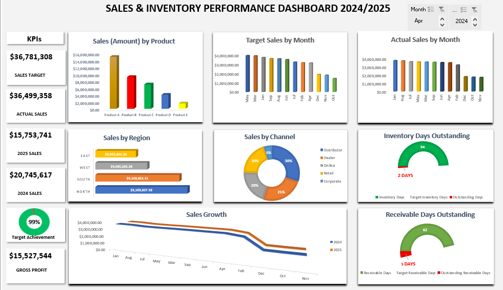

# Sales & Inventory Performance Dashboard (Excel)

## Project Overview

This project presents an interactive Sales & Inventory Performance Dashboard built in Microsoft Excel using Pivot Tables, Power Pivot, and Data Model relationships.

The dashboard helps analyze sales performance against targets while monitoring inventory turnover and receivable days.

## Dashboard Preview

## Key Features

- KPI tracking for Sales Target, Actual Sales, and Gross Profit
- Product performance analysis
- Regional sales comparison
- Sales channel distribution
- Monthly target vs actual sales tracking
- Inventory Days Outstanding gauge
- Receivable Days Outstanding gauge
- Interactive filters using slicers for Month and Year

## Tools Used

- Microsoft Excel
- Pivot Tables
- Power Pivot Data Model
- Slicers
- Donut Charts
- Gauge Chart (custom built)

## Key Insights

- Total Sales Target: $36,781,308
- Actual Sales: $36,499,358
- Target Achievement: 99%
- Gross Profit: $15,527,544

Sales are strongly driven by Product A, while the Distributor channel contributes the largest share of sales (30%).

Inventory management is efficient with 94 inventory days vs a target of 96 days.

However, Receivable Days exceed the target by 5 days, indicating slower customer payment cycles.

## Project Structure

data/
Sales_Data.xlsx
Sales_Monthly_Target.xlsx
Month_Table.xlsx

dashboard/
Sales_Inventory_Dashboard.png

report/
Sales_Inventory_Dashboard.xlsx

## Author

Damilola Oluwagbamila
